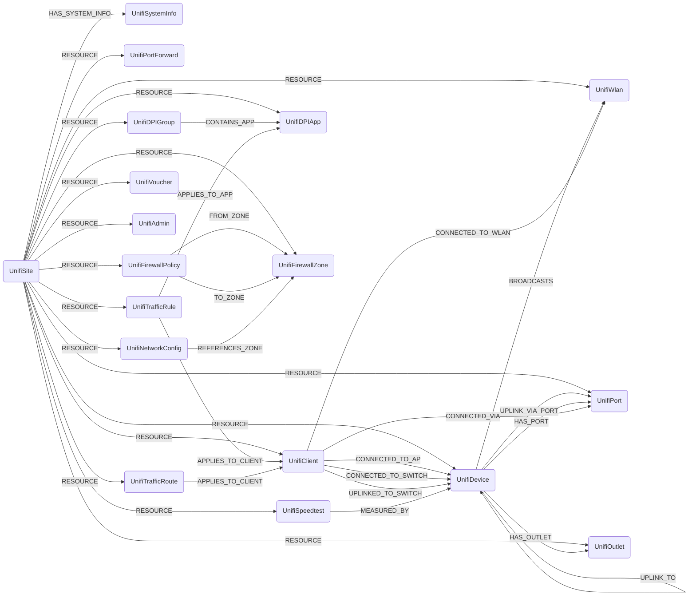

## UniFi Schema



### UnifiSite

Representation of a [UniFi site](https://help.ui.com/hc/en-us/articles/360012888634-UniFi-How-to-Set-Up-a-UniFi-Network-on-the-UniFi-OS-Console), the top-level organizational unit in a UniFi deployment.

> **Ontology Mapping**: This node has the extra label `Tenant` to enable cross-platform queries for organizational tenants across different systems (e.g., OktaOrganization, AzureTenant, GCPOrganization).

| Field | Description |
|-------|-------------|
| firstseen | Timestamp of when a sync job first discovered this node |
| lastupdated | Timestamp of the last time the node was updated |
| **id** | The site ID (e.g. `default`) |
| name | Human-readable site name |
| desc | Site description |
| role | Admin role for this site |

#### Relationships

- A UnifiSite has system information

    ```
    (UnifiSite)-[HAS_SYSTEM_INFO]->(UnifiSystemInfo)
    ```

- A UnifiSite contains UnifiDevices

    ```
    (UnifiSite)-[RESOURCE]->(UnifiDevice)
    ```

- A UnifiSite contains UnifiClients

    ```
    (UnifiSite)-[RESOURCE]->(UnifiClient)
    ```

- A UnifiSite contains UnifiWlans

    ```
    (UnifiSite)-[RESOURCE]->(UnifiWlan)
    ```

- A UnifiSite contains UnifiPorts

    ```
    (UnifiSite)-[RESOURCE]->(UnifiPort)
    ```

- A UnifiSite contains UnifiPortForwards

    ```
    (UnifiSite)-[RESOURCE]->(UnifiPortForward)
    ```

- A UnifiSite contains UnifiTrafficRules

    ```
    (UnifiSite)-[RESOURCE]->(UnifiTrafficRule)
    ```

- A UnifiSite contains UnifiTrafficRoutes

    ```
    (UnifiSite)-[RESOURCE]->(UnifiTrafficRoute)
    ```

- A UnifiSite contains UnifiDPIGroups

    ```
    (UnifiSite)-[RESOURCE]->(UnifiDPIGroup)
    ```

- A UnifiSite contains UnifiDPIApps

    ```
    (UnifiSite)-[RESOURCE]->(UnifiDPIApp)
    ```

- A UnifiSite contains UnifiFirewallPolicies

    ```
    (UnifiSite)-[RESOURCE]->(UnifiFirewallPolicy)
    ```

- A UnifiSite contains UnifiFirewallZones

    ```
    (UnifiSite)-[RESOURCE]->(UnifiFirewallZone)
    ```

- A UnifiSite contains UnifiVouchers

    ```
    (UnifiSite)-[RESOURCE]->(UnifiVoucher)
    ```

---

### UnifiDevice

Representation of a UniFi network device (access point, switch, gateway, etc.).

> **Ontology Mapping**: This node has the extra label `NetworkInfrastructureDevice` to enable cross-platform queries for network infrastructure devices across different systems. It also links to the canonical `Device` ontology node via the `OBSERVED_AS` relationship using hostname matching.

| Field | Description |
|-------|-------------|
| firstseen | Timestamp of when a sync job first discovered this node |
| lastupdated | Timestamp of the last time the node was updated |
| **id** | Device MAC address (used as unique identifier) |
| mac | Device MAC address |
| adopted | Whether the device has been adopted by the controller |
| type | Device type (e.g. `uap`, `usw`, `ugw`) |
| model | Device model code (e.g. `U7PG2`, `US24P250`) |
| name | Human-readable device name |
| **ip** | Current IP address of the device |
| version | Firmware version string |
| state | Device state (e.g. `CONNECTED`, `DISCONNECTED`, `UPGRADING`) |
| uptime | Seconds since the device last rebooted |
| last_seen | Unix timestamp of last contact with the controller |
| upgradable | Whether a firmware upgrade is available |
| uplink_mac | MAC address of the upstream device this device uplinks to |
| uplink_port_id | Composite ID of the upstream port this device connects through (`<uplink_mac>_<port_idx>`) |
| wlan_ids | List of WLAN IDs broadcast by this device (access points only) |

#### Relationships

- A UnifiDevice belongs to a UnifiSite

    ```
    (UnifiSite)-[RESOURCE]->(UnifiDevice)
    ```

- A UnifiDevice uplinks to another UnifiDevice

    ```
    (UnifiDevice)-[UPLINK_TO]->(UnifiDevice)
    ```

- A UnifiDevice uplinks through a specific UnifiPort on the upstream device

    ```
    (UnifiDevice)-[UPLINK_VIA_PORT]->(UnifiPort)
    ```

- A UnifiDevice (access point) broadcasts UnifiWlans

    ```
    (UnifiDevice)-[BROADCASTS]->(UnifiWlan)
    ```

- A UnifiDevice has UnifiPorts

    ```
    (UnifiDevice)-[HAS_PORT]->(UnifiPort)
    ```

- A wireless UnifiClient is connected to a UnifiDevice (access point)

    ```
    (UnifiClient)-[CONNECTED_TO_AP]->(UnifiDevice)
    ```

- A wired UnifiClient is connected to a UnifiDevice (switch) via `sw_mac`

    ```
    (UnifiClient)-[CONNECTED_TO_SWITCH]->(UnifiDevice)
    ```

- A wireless UnifiClient uplinks to a UnifiDevice (switch) via `ap_switch_mac`

    ```
    (UnifiClient)-[UPLINKED_TO_SWITCH]->(UnifiDevice)
    ```

---

### UnifiClient

Representation of a client currently connected to the UniFi network.

> **Ontology Mapping**: This node has the extra label `NetworkEndpoint` to enable cross-platform queries for network endpoints across different systems. It also links to the semantic `UserAccount` ontology label via the `HAS_ACCOUNT` relationship using hostname matching.

| Field | Description |
|-------|-------------|
| firstseen | Timestamp of when a sync job first discovered this node |
| lastupdated | Timestamp of the last time the node was updated |
| **id** | Client MAC address (used as unique identifier) |
| mac | Client MAC address |
| **ip** | Current IP address of the client |
| hostname | Client hostname (from DHCP or mDNS) |
| name | Human-readable alias set in the controller |
| is_guest | Whether this is a guest network client |
| oui | Organizationally Unique Identifier (manufacturer) |
| satisfaction | Connection quality score (0–100) |
| channel | WiFi channel in use (wireless clients only) |
| radio | Radio band (`ng` = 2.4 GHz, `na` = 5 GHz; wireless clients only) |
| essid | SSID the client is connected to (wireless clients only) |
| is_wired | Whether the client is connected via ethernet |
| blocked | Whether this client is blocked on the network |
| qos_policy_applied | Whether a QoS policy is applied to this client |
| uptime | Seconds the client has been continuously connected |
| last_seen | Unix timestamp of last activity |
| vlan | VLAN ID the client is on (wired clients only) |
| sw_mac | MAC address of the switch the client is connected to (wired clients only) |
| sw_port | Switch port number the client is connected to (wired clients only) |
| ap_switch_mac | MAC address of the switch the client's AP uplinks to (wireless clients only) |

#### Relationships

- A UnifiClient belongs to a UnifiSite

    ```
    (UnifiSite)-[RESOURCE]->(UnifiClient)
    ```

- A wireless UnifiClient is connected to its access point (AP)

    ```
    (UnifiClient)-[CONNECTED_TO_AP]->(UnifiDevice)
    ```

- A wired UnifiClient is connected to a UnifiDevice (switch) via `sw_mac`

    ```
    (UnifiClient)-[CONNECTED_TO_SWITCH]->(UnifiDevice)
    ```

- A wireless UnifiClient uplinks to a UnifiDevice (switch) via `ap_switch_mac`

    ```
    (UnifiClient)-[UPLINKED_TO_SWITCH]->(UnifiDevice)
    ```

- A wireless UnifiClient is connected to a UnifiWlan (matched by SSID name, scoped to site)

    ```
    (UnifiClient)-[CONNECTED_TO_WLAN]->(UnifiWlan)
    ```

- A wired UnifiClient connects via a specific UnifiPort

    ```
    (UnifiClient)-[CONNECTED_VIA]->(UnifiPort)
    ```

---

### UnifiWlan

Representation of a UniFi wireless network (SSID) configuration.

> **Ontology Mapping**: This node has the extra label `NetworkAccessPoint` to enable cross-platform queries for wireless access points across different systems.

| Field | Description |
|-------|-------------|
| firstseen | Timestamp of when a sync job first discovered this node |
| lastupdated | Timestamp of the last time the node was updated |
| **id** | WLAN unique ID |
| **name** | SSID (network name) |
| enabled | Whether this WLAN is currently active |
| is_guest | Whether this is a guest WLAN |
| security | Security type (e.g. `wpapsk`, `open`) |
| wpa_mode | WPA mode (e.g. `wpa2`, `wpa3`) |
| wpa_enc | WPA encryption (e.g. `ccmp`) |
| usergroup_id | Associated user group ID |
| hide_ssid | Whether the SSID is hidden from scans |
| mac_filter_enabled | Whether MAC address filtering is active |
| mac_filter_policy | MAC filter policy (`allow` or `deny`) |
| bc_filter_enabled | Whether broadcast/multicast filtering is enabled |
| no2ghz_oui | Whether to suppress 2.4 GHz for devices with a 5 GHz-capable OUI |
| name_combine_enabled | Whether band-steering combines 2.4 GHz and 5 GHz under a single SSID |
| wlangroup_id | WLAN group this network belongs to |
| schedule | Active time schedule (list of day strings, empty = always on) |
| site_id | ID of the site this WLAN belongs to (used for site-scoped client matching) |

#### Relationships

- A UnifiWlan belongs to a UnifiSite

    ```
    (UnifiSite)-[RESOURCE]->(UnifiWlan)
    ```

- A UnifiDevice (access point) broadcasts this UnifiWlan

    ```
    (UnifiDevice)-[BROADCASTS]->(UnifiWlan)
    ```

- Wireless UnifiClients are connected to this UnifiWlan

    ```
    (UnifiClient)-[CONNECTED_TO_WLAN]->(UnifiWlan)
    ```

---

### UnifiPort

Representation of a physical switch port on a UniFi device.

> **Ontology Mapping**: This node has the extra label `NetworkInterface` to enable cross-platform queries for network interfaces across different systems.

| Field | Description |
|-------|-------------|
| firstseen | Timestamp of when a sync job first discovered this node |
| lastupdated | Timestamp of the last time the node was updated |
| **id** | Composite ID (`<device_mac>_<port_idx>`) |
| port_idx | Port number on the device |
| name | Port label/name |
| port_poe | Whether this port supports PoE hardware |
| poe_enable | Whether PoE is currently enabled on this port |
| poe_mode | PoE operating mode (e.g. `auto`) |
| poe_voltage | PoE voltage level |
| portconf_id | Applied port profile ID |
| up | Whether the port link is currently up |
| speed | Link speed in Mbps |
| full_duplex | Whether the port is running in full-duplex mode |

#### Relationships

- A UnifiPort belongs to a UnifiSite

    ```
    (UnifiSite)-[RESOURCE]->(UnifiPort)
    ```

- A UnifiPort is a physical port on a UnifiDevice

    ```
    (UnifiDevice)-[HAS_PORT]->(UnifiPort)
    ```

- A wired UnifiClient connects through this UnifiPort

    ```
    (UnifiClient)-[CONNECTED_VIA]->(UnifiPort)
    ```

- A UnifiDevice uplinks to its upstream switch through this UnifiPort

    ```
    (UnifiDevice)-[UPLINK_VIA_PORT]->(UnifiPort)
    ```

---

### UnifiPortForward

Representation of a NAT port forwarding rule on the UniFi gateway.

> **Ontology Mapping**: This node has the extra label `NetworkAddressTranslation` to enable cross-platform queries for NAT/port forwarding rules across different systems.

| Field | Description |
|-------|-------------|
| firstseen | Timestamp of when a sync job first discovered this node |
| lastupdated | Timestamp of the last time the node was updated |
| **id** | Port forward rule unique ID |
| name | Rule name |
| enabled | Whether this rule is active |
| destination_port | External destination port |
| forward_port | Internal port to forward to |
| forward_ip | Internal IP address to forward to |
| protocol | Protocol (`tcp`, `udp`, `tcp_udp`) |
| interface | WAN interface |
| source | Allowed source IP or `any` |

#### Relationships

- A UnifiPortForward belongs to a UnifiSite

    ```
    (UnifiSite)-[RESOURCE]->(UnifiPortForward)
    ```

---

### UnifiTrafficRule

Representation of a UniFi traffic management rule (QoS, blocking, application control, etc.).

> **Ontology Mapping**: This node has the extra label `NetworkRoutingRule` to enable cross-platform queries for network routing and traffic management rules across different systems.

| Field | Description |
|-------|-------------|
| firstseen | Timestamp of when a sync job first discovered this node |
| lastupdated | Timestamp of the last time the node was updated |
| **id** | Rule unique ID |
| description | Human-readable rule description |
| enabled | Whether this rule is active |
| action | Rule action (`BLOCK`, `ALLOW`) |
| matching_target | Target type (`INTERNET`, `IP`, `DOMAIN`, `REGION`) |
| bandwidth_limit_enabled | Whether bandwidth limiting is active |
| download_limit_kbps | Download bandwidth limit in Kbps |
| upload_limit_kbps | Upload bandwidth limit in Kbps |
| app_ids | List of DPI application IDs this rule targets |
| app_category_ids | List of DPI application category IDs this rule targets |
| network_ids | List of network IDs this rule applies to |
| domains | List of domain names this rule matches |
| target_client_macs | List of client MAC addresses this rule explicitly targets |

#### Relationships

- A UnifiTrafficRule belongs to a UnifiSite

    ```
    (UnifiSite)-[RESOURCE]->(UnifiTrafficRule)
    ```

- A UnifiTrafficRule targets specific UnifiDPIApps

    ```
    (UnifiTrafficRule)-[APPLIES_TO_APP]->(UnifiDPIApp)
    ```

- A UnifiTrafficRule targets specific UnifiClients

    ```
    (UnifiTrafficRule)-[APPLIES_TO_CLIENT]->(UnifiClient)
    ```

---

### UnifiTrafficRoute

Representation of a policy-based routing rule on the UniFi gateway.

> **Ontology Mapping**: This node has the extra label `NetworkRoutingRule` to enable cross-platform queries for network routing and traffic management rules across different systems.

| Field | Description |
|-------|-------------|
| firstseen | Timestamp of when a sync job first discovered this node |
| lastupdated | Timestamp of the last time the node was updated |
| **id** | Route unique ID |
| description | Human-readable route description |
| enabled | Whether this route is active |
| matching_target | Matching target type (e.g. `IP`, `DOMAIN`, `REGION`) |
| network_id | ID of the network this route applies to |
| next_hop | Next-hop IP address for this route |
| regions | List of geographic region codes this route matches |
| domains | List of domain names this route matches |
| target_client_macs | List of client MAC addresses this route explicitly targets |

#### Relationships

- A UnifiTrafficRoute belongs to a UnifiSite

    ```
    (UnifiSite)-[RESOURCE]->(UnifiTrafficRoute)
    ```

- A UnifiTrafficRoute targets specific UnifiClients

    ```
    (UnifiTrafficRoute)-[APPLIES_TO_CLIENT]->(UnifiClient)
    ```

---

### UnifiDPIGroup

Representation of a Deep Packet Inspection (DPI) application group in UniFi.

> **Ontology Mapping**: This node has the extra label `NetworkSecurityPolicy` to enable cross-platform queries for network security policies across different systems.

| Field | Description |
|-------|-------------|
| firstseen | Timestamp of when a sync job first discovered this node |
| lastupdated | Timestamp of the last time the node was updated |
| **id** | DPI group unique ID |
| name | Group name |
| attr_no_delete | Whether this group cannot be deleted (built-in) |
| attr_hidden_id | Internal hidden ID for built-in groups |
| dpiapp_ids | List of DPI application IDs in this group |

#### Relationships

- A UnifiDPIGroup belongs to a UnifiSite

    ```
    (UnifiSite)-[RESOURCE]->(UnifiDPIGroup)
    ```

- A UnifiDPIGroup contains UnifiDPIApps

    ```
    (UnifiDPIGroup)-[CONTAINS_APP]->(UnifiDPIApp)
    ```

---

### UnifiDPIApp

Representation of a Deep Packet Inspection (DPI) application restriction in UniFi.

> **Ontology Mapping**: This node has the extra label `NetworkSecurityPolicy` to enable cross-platform queries for network security policies across different systems.

| Field | Description |
|-------|-------------|
| firstseen | Timestamp of when a sync job first discovered this node |
| lastupdated | Timestamp of the last time the node was updated |
| **id** | DPI application unique ID |
| blocked | Whether this application is blocked |
| enabled | Whether this DPI restriction is active |
| log | Whether matching traffic is logged |

#### Relationships

- A UnifiDPIApp belongs to a UnifiSite

    ```
    (UnifiSite)-[RESOURCE]->(UnifiDPIApp)
    ```

- A UnifiDPIGroup contains this UnifiDPIApp

    ```
    (UnifiDPIGroup)-[CONTAINS_APP]->(UnifiDPIApp)
    ```

- A UnifiTrafficRule targets this UnifiDPIApp

    ```
    (UnifiTrafficRule)-[APPLIES_TO_APP]->(UnifiDPIApp)
    ```

---

### UnifiFirewallPolicy

Representation of a firewall policy rule in UniFi.

> **Ontology Mapping**: This node has the extra label `NetworkAccessControl` to enable cross-platform queries for network access control policies across different systems.

| Field | Description |
|-------|-------------|
| firstseen | Timestamp of when a sync job first discovered this node |
| lastupdated | Timestamp of the last time the node was updated |
| **id** | Policy unique ID |
| name | Policy name |
| description | Policy description |
| enabled | Whether this policy is active |
| action | Policy action (`ALLOW`, `DENY`) |
| protocol | Matched protocol (e.g. `tcp`, `udp`, `all`) |
| predefined | Whether this is a built-in policy |
| index | Policy priority order (lower = higher priority) |
| ip_version | IP version matched (`IPv4`, `IPv6`) |
| connection_state_type | Connection state matched (e.g. `NEW`, `ESTABLISHED`, `ALL`) |
| logging | Whether matching traffic is logged |
| source_zone_id | ID of the source firewall zone |
| destination_zone_id | ID of the destination firewall zone |

#### Relationships

- A UnifiFirewallPolicy belongs to a UnifiSite

    ```
    (UnifiSite)-[RESOURCE]->(UnifiFirewallPolicy)
    ```

- A UnifiFirewallPolicy originates from a source UnifiFirewallZone

    ```
    (UnifiFirewallPolicy)-[FROM_ZONE]->(UnifiFirewallZone)
    ```

- A UnifiFirewallPolicy targets a destination UnifiFirewallZone

    ```
    (UnifiFirewallPolicy)-[TO_ZONE]->(UnifiFirewallZone)
    ```

---

### UnifiFirewallZone

Representation of a network security zone in UniFi.

> **Ontology Mapping**: This node has the extra label `NetworkZone` to enable cross-platform queries for network security zones across different systems.

| Field | Description |
|-------|-------------|
| firstseen | Timestamp of when a sync job first discovered this node |
| lastupdated | Timestamp of the last time the node was updated |
| **id** | Zone unique ID |
| **name** | Zone name (e.g. `LAN`, `WAN`, `Guest`) |
| attr_no_edit | Whether this zone cannot be edited (built-in) |
| default_zone | Whether this is a default built-in zone |
| zone_key | Internal zone key (e.g. `lan`, `wan`) |
| network_ids | List of network IDs assigned to this zone |
| site_id | ID of the site this zone belongs to |

#### Relationships

- A UnifiFirewallZone belongs to a UnifiSite

    ```
    (UnifiSite)-[RESOURCE]->(UnifiFirewallZone)
    ```

- UnifiFirewallPolicies reference this zone as their source

    ```
    (UnifiFirewallPolicy)-[FROM_ZONE]->(UnifiFirewallZone)
    ```

- UnifiFirewallPolicies reference this zone as their destination

    ```
    (UnifiFirewallPolicy)-[TO_ZONE]->(UnifiFirewallZone)
    ```

---

### UnifiSystemInfo

Representation of UniFi controller metadata and version information.

> **Ontology Mapping**: This node has the extra label `NetworkController` to enable cross-platform queries for network controllers across different systems.

| Field | Description |
|-------|-------------|
| firstseen | Timestamp of when a sync job first discovered this node |
| lastupdated | Timestamp of the last time the node was updated |
| **id** | Unique controller ID |
| **anonymous_controller_id** | Anonymous UUID for the controller |
| hostname | Controller hostname |
| name | Controller display name |
| version | Current software version |
| previous_version | Previous software version |
| update_available | Whether a software update is available |
| ip_addrs | List of IP addresses for the controller |
| is_cloud_console | Whether this is a cloud-hosted console |
| ubnt_device_type | Ubiquiti device type (e.g. `UDM-Pro`) |

#### Relationships

- A UnifiSite has UnifiSystemInfo

    ```
    (UnifiSite)-[HAS_SYSTEM_INFO]->(UnifiSystemInfo)
    ```

---

### UnifiVoucher

Representation of a guest network hotspot voucher in UniFi.

> **Ontology Mapping**: This node has the extra label `NetworkGuestAccess` to enable cross-platform queries for guest network access mechanisms across different systems.

| Field | Description |
|-------|-------------|
| firstseen | Timestamp of when a sync job first discovered this node |
| lastupdated | Timestamp of the last time the node was updated |
| **id** | Voucher unique ID |
| **code** | The voucher code (indexed for quick lookup) |
| note | Optional note attached to this voucher |
| quota | Maximum number of uses (0 = unlimited) |
| duration | Session duration in minutes |
| qos_overwrite | Whether QoS limits override the default profile |
| qos_usage_quota | Data usage quota in MB (null = unlimited) |
| qos_rate_max_up | Upload speed limit in Kbps |
| qos_rate_max_down | Download speed limit in Kbps |
| used | Number of times this voucher has been used |
| create_time | Unix timestamp when the voucher was created |
| start_time | Unix timestamp when the first session started |
| end_time | Unix timestamp when the last session ended |
| for_hotspot | Whether this voucher is for a hotspot portal |
| admin_name | Username of the admin who created the voucher |
| status | Voucher status (`VALID_MULTI`, `USED_MULTIPLE`, `EXPIRED`, etc.) |
| status_expires | Unix timestamp when the voucher expires |

#### Relationships

- A UnifiVoucher belongs to a UnifiSite

    ```
    (UnifiSite)-[RESOURCE]->(UnifiVoucher)
    ```

---

### UnifiAdmin

Representation of a UniFi controller administrator account.

> **Ontology Mapping**: This node has the extra label `UserAccount` to enable cross-platform queries for user accounts across different systems (e.g., OktaUser, EntraUser, GSuiteUser). It also links to the semantic `UserAccount` ontology label via the `HAS_ACCOUNT` relationship using email matching.

| Field | Description |
|-------|-------------|
| firstseen | Timestamp of when a sync job first discovered this node |
| lastupdated | Timestamp of the last time the node was updated |
| **id** | Admin unique ID |
| name | Admin username |
| **email** | Admin email address (indexed for quick lookup) |
| role | Admin role (e.g. `admin`, `readonly`) |
| is_super_admin | Whether this admin has super-admin privileges |
| last_site_name | Last site this admin accessed |

#### Relationships

- A UnifiAdmin belongs to a UnifiSite

    ```
    (UnifiSite)-[RESOURCE]->(UnifiAdmin)
    ```

- A UnifiAdmin has a UserAccount via email

    ```
    (UnifiAdmin)-[HAS_ACCOUNT]->(UserAccount)
    ```

---

### UnifiNetworkConfig

Representation of a UniFi object-oriented network configuration (QoS, routing, security policies).

> **Ontology Mapping**: This node has the extra labels `NetworkQoSPolicy`, `NetworkSecurityPolicy`, `NetworkRoutingPolicy` to enable cross-platform queries for network policies across different systems.

| Field | Description |
|-------|-------------|
| firstseen | Timestamp of when a sync job first discovered this node |
| lastupdated | Timestamp of the last time the node was updated |
| **id** | Network configuration unique ID |
| **name** | Configuration name |
| enabled | Whether this configuration is active |
| target_type | Target type (e.g. `network`, `client`, `wlan`) |
| targets | List of target IDs this configuration applies to |
| secure_enabled | Whether security/firewall rules are enabled |
| secure_firewall_rules | Firewall rule IDs for secure configuration |
| secure_group_ids | Firewall zone IDs for secure configuration |
| qos_enabled | Whether QoS is enabled |
| qos_bandwidth_limit | Bandwidth limit in Kbps |
| qos_dscp | DSCP marking value |
| route_enabled | Whether policy-based routing is enabled |
| route_nexthop | Next-hop IP for routing |
| route_network | Network CIDR for routing |

#### Relationships

- A UnifiNetworkConfig belongs to a UnifiSite

    ```
    (UnifiSite)-[RESOURCE]->(UnifiNetworkConfig)
    ```

- A UnifiNetworkConfig references UnifiFirewallZones for secure configuration

    ```
    (UnifiNetworkConfig)-[REFERENCES_ZONE]->(UnifiFirewallZone)
    ```

---

### UnifiOutlet

Representation of a power outlet on a UniFi PDU (Power Distribution Unit) or switch with PoE outlets.

> **Ontology Mapping**: This node has the extra labels `PowerOutlet`, `IoTDevice` to enable cross-platform queries for power outlets and IoT devices across different systems.

| Field | Description |
|-------|-------------|
| firstseen | Timestamp of when a sync job first discovered this node |
| lastupdated | Timestamp of the last time the node was updated |
| **id** | Composite ID (`<device_mac>_<index>`) |
| name | Outlet name/label |
| index | Outlet index on the device |
| has_relay | Whether this outlet has a controllable relay |
| relay_state | Whether the outlet relay is on (powered) |
| cycle_enabled | Whether power cycling is enabled |
| has_metering | Whether power metering is supported |
| caps | Outlet capabilities bitmask (1=relay, 3=relay+metering) |
| voltage | Voltage reading in volts |
| current | Current draw in amps |
| power | Power consumption in watts |
| power_factor | Power factor (0.0-1.0) |

#### Relationships

- A UnifiOutlet belongs to a UnifiSite

    ```
    (UnifiSite)-[RESOURCE]->(UnifiOutlet)
    ```

- A UnifiOutlet is on a UnifiDevice (PDU or switch)

    ```
    (UnifiDevice)-[HAS_OUTLET]->(UnifiOutlet)
    ```

---

### UnifiSpeedtest

Representation of a WAN speedtest result from the UniFi gateway.

> **Ontology Mapping**: This node has the extra label `NetworkPerformanceTest` to enable cross-platform queries for network performance tests across different systems.

| Field | Description |
|-------|-------------|
| firstseen | Timestamp of when a sync job first discovered this node |
| lastupdated | Timestamp of the last time the node was updated |
| **id** | Interface name (e.g. `wan1`, `wan2`) |
| interface_name | WAN interface name |
| download | Download speed in Mbps |
| upload | Upload speed in Mbps |
| ping | Latency in milliseconds |
| timestamp | Unix timestamp of the test |

#### Relationships

- A UnifiSpeedtest belongs to a UnifiSite

    ```
    (UnifiSite)-[RESOURCE]->(UnifiSpeedtest)
    ```

- A UnifiSpeedtest was measured by a UnifiDevice (gateway)

    ```
    (UnifiSpeedtest)-[MEASURED_BY]->(UnifiDevice)
    ```
